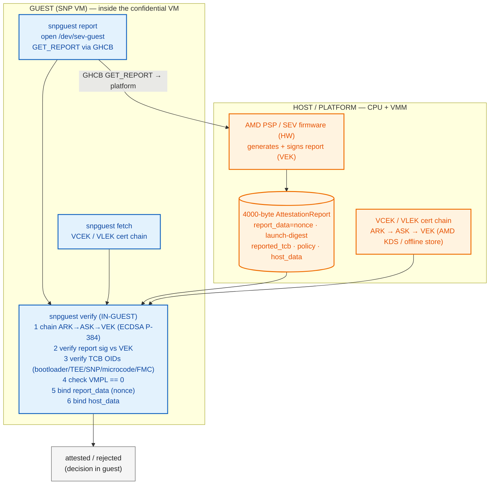

# AMD SEV-SNP Attestation — snpguest (in-guest verification)

**Scope:** SEV-SNP report generation + verification entirely via `snpguest` (runs in the guest). No Trustee.
**Basis:** SLES 16.1 source tree (`snpguest-0.10.0`).
**Guest vs host:** blue = runs **inside the SNP VM (guest)**; orange = runs **on the host / platform** (CPU firmware, VMM).

---

## Flow

---

## Notes

- `snpguest verify` does the **full report verification in the guest**: cert chain, report signature, TCB OIDs, VMPL, `report_data`, `host_data`.
- The guest only *triggers* report generation via GHCB; the report is produced and signed by the CPU's PSP (platform).
- `snpguest fetch` pulls the VCEK/VLEK chain (AMD KDS or offline store) so verification can run fully in-guest.
- `snpguest generate` (preattestation) computes the launch digest (OVMF/kernel/initrd/VMSA) before launch.

## Legend

| Term | Meaning |
|------|---------|
| **snpguest** | Guest CLI (`/dev/sev-guest`). Subcommands: `report` (request report), `fetch` (VCEK/VLEK), `verify` (verify report + certs), `generate` (preattestation launch digest). |
| **VEK** | Versioned Endorsement Key — **VCEK** (per-chip) or **VLEK** (cloud-provisioned, Turin+). Signs the report. |
| **report_data** | 64-byte nonce/challenge field; binding it proves freshness and ties the report to this session. |
| **host_data** | 32-byte field set at launch; binds the report to the VM's launch parameters. |
| **launch-digest** | 48-byte (384-bit) measurement of guest launch (OVMF, kernel, initrd, VMSA). |
| **TCB OIDs** | Five Service-Provider-Level checks in the VEK cert: bootloader, TEE, SNP, microcode, FMC (Turin+). |
| **VMPL** | VM Privilege Level. Verifier requires `VMPL == 0` (guest OS). |
| **GHCB** | Guest-Hypervisor Communication Block — guest→firmware channel for `GET_REPORT`. |
| **ARK → ASK → VEK** | AMD cert chain: AMD Root Key → AMD Signing Key → Versioned Endorsement Key. |
