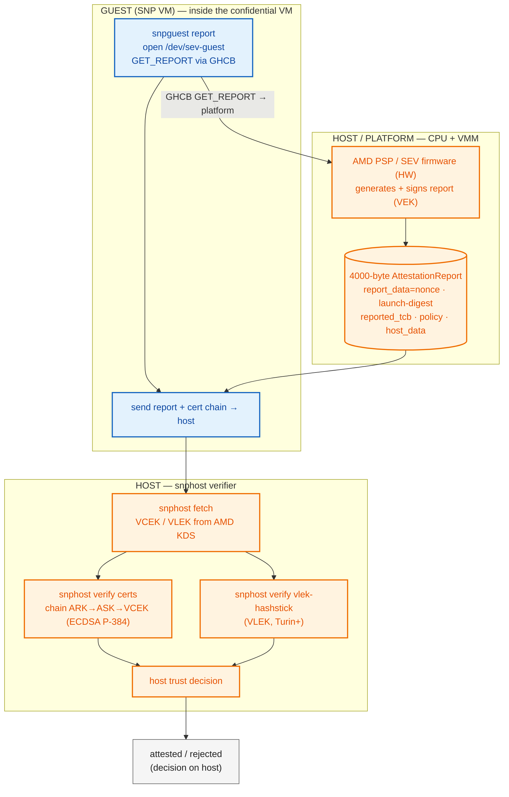

# AMD SEV-SNP Attestation — snphost (host-side verification)

**Scope:** SEV-SNP report generated in the guest; certificate chain + VLEK verified **on the host** via `snphost`. No Trustee.
**Basis:** SLES 16.1 source tree (`snphost-0.7.0`).
**Guest vs host:** blue = runs **inside the SNP VM (guest)**; orange = runs **on the host / platform** (CPU firmware, VMM, `snphost`).

---

## Flow

---

## Notes

- `snphost` verifies the **certificate chain on the host**: `verify certs` (ARK→ASK→VCEK) and `verify vlek-hashstick` (VLEK, Turin+).
- `snphost` is a host tool (`/dev/sev`): `fetch` (KDS), `import`/`export` (cert chain), `ok` (platform probe), `vlek-load` (load VLEK), `verify` (cert chain / VLEK hashstick).
- The guest still generates the report (via `snpguest report`); the host (`snphost`) verifies the cert chain.
- Note: full report binding (`report_data`/`host_data`/VMPL) is `snpguest`'s domain — `snphost verify` focuses on the cert chain + VLEK hashstick, not the report's nonce/host_data binding.

## Legend

| Term | Meaning |
|------|---------|
| **snphost** | Host CLI (`/dev/sev`). Subcommands: `show`, `export`, `import`, `ok` (probe), `config`, `verify` (certs / vlek-hashstick), `fetch` (KDS), `commit`, `vlek-load`. |
| **VEK** | Versioned Endorsement Key — **VCEK** (per-chip) or **VLEK** (cloud-provisioned, Turin+). Signs the report. |
| **VLEK hashstick** | Per-VM VLEK hash committed to the PSP; `snphost verify vlek-hashstick` validates it (Turin+). |
| **report_data** | 64-byte nonce/challenge field (bound by `snpguest`, not `snphost`). |
| **host_data** | 32-byte launch field (bound by `snpguest`, not `snphost`). |
| **launch-digest** | 48-byte (384-bit) measurement of guest launch (OVMF, kernel, initrd, VMSA). |
| **GHCB** | Guest-Hypervisor Communication Block — guest→firmware channel for `GET_REPORT`. |
| **ARK → ASK → VEK** | AMD cert chain: AMD Root Key → AMD Signing Key → Versioned Endorsement Key. |
| **KDS** | AMD Key Distribution Server — source of VCEK/VLEK certs. |
